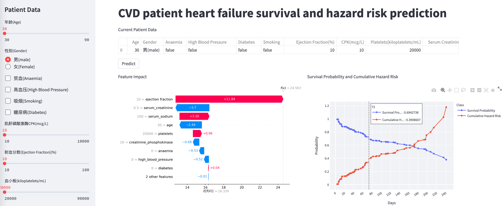

# Heart Failure Survival and Hazard Risk Prediction

Libraries:    
* scikit-survival==0.16.0
* streamlit ==1.2.0
* matplotlib==3.3.4
* plotly-express==0.4.1
* pandas==1.2.5
* numpy==1.21.3
* shap==0.39.0
 
Run:

 1. Use Jupyter note book to generate your own models
 2. All models will be saved to pickle files
 3. use "streamlit run HF_prediction_v1_en.py" or "streamlit run HF_prediction_v1_cn.py" to run the webapp